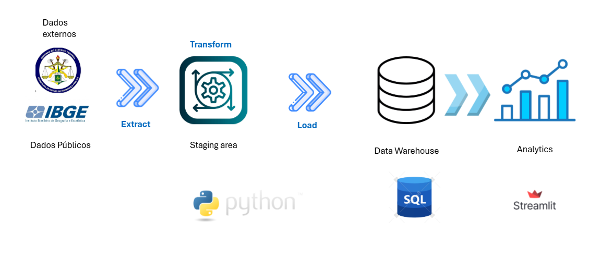
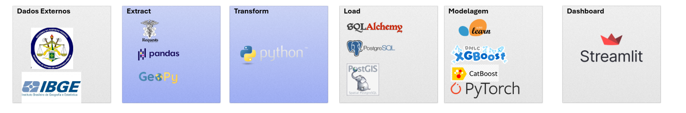

# Projeto Criminalidade Brasília - DF

> **Nota de atualização:** esta documentação foi revisada para refletir o que está **efetivamente implementado no código** na data desta análise. A versão anterior descrevia uma arquitetura geoespacial com PostGIS, malha hexagonal, dashboard Streamlit e API FastAPI — nenhum desses componentes existia naquele momento no repositório. Eles foram movidos para a seção [Roadmap](#-roadmap--visão-futura) conforme ainda pendentes, ou promovidos de volta ao corpo do documento à medida que foram implementados (caso da API, ver abaixo).
>
> **Revisão mais recente (verificada rodando a suíte de fato, commit `38a3d92`):** a cobertura de testes configurada em `pytest.ini` foi ampliada — hoje mede `analysis`, `api`, `config`, `database`, `domain`, `ingestion`, `processing`, `src` e `util` (não mais apenas `src`, `util` e `database`); só `validation/` segue sem cobertura própria. Números reais desta rodada: **391 testes coletados, 388 passando, 3 falhando, 99,18% de cobertura** (limiar mínimo 95%, atingido). As 3 falhas são um bug real e reprodutível, não um problema de ambiente — ver [Observações e Pontos de Atenção](#-observações-e-pontos-de-atenção-herdados-da-análise-técnica-do-projeto). Também confirmado nesta revisão: `.env` **não está mais rastreado pelo Git** (item antes pendente, já resolvido), e todos os modelos `xgb_residual_log_*.pkl` já possuem `_meta.json` completo (a documentação anterior afirmava o contrário).
>
> **Implementação de item do roadmap — persistência do Prophet:** o item "persistir o modelo Prophet junto ao XGBoost em `models/`" foi implementado. `save_model_with_metadata` agora aceita um `prophet_model` opcional e salva o par como um único artefato "bundle"; `GET /previsao/crimes-contra-mulher` passa a servir por padrão a partir do bundle mais recente em disco (sem re-treinar), com fallback automático para treino quando não há artefato utilizável; um novo endpoint `POST /previsao/retrain` força o re-treino explícito. Detalhes em [Camada de Consumo (API)](#-camada-de-consumo-api--api). 16 novos testes adicionados (391 → 407 testes coletados), cobertura de `api/services/forecast_service.py` em 100%.
>
> **Revisão mais recente:** dashboard Streamlit implementado (séries temporais com **total consolidado + RAs selecionáveis** e média móvel, mapa de calor RA × ano, ranking, previsões e exploração das tabelas gold) e bug de variável de ambiente `POSTGRES_USERNAME` vs `POSTGRES_USER` em `tests/database/test_connection.py` corrigido — **486 testes, todos passando, 99,29% de cobertura**. Ver [Dashboard Interativo](#-dashboard-interativo-streamlit--dashboard) e [Qualidade e Testes](#-qualidade-e-testes).
>
> **Testes E2E e de carga da API:** além da suíte `pytest`, a API de consumo ganhou duas camadas de teste externas ao Python — uma suíte **E2E em Karate DSL (Gherkin/Cucumber)** com relatório **Allure** (`karate-tests/`) e uma suíte de **carga/performance em Gatling (Scala)** (`gatling-tests/`), que exercita o fluxo principal do dashboard sob rampa de usuários com asserções de taxa de sucesso (≥99%) e p95 (limite configurável). Ver [Testes E2E da API](#-testes-e2e-da-api-karate-dsl--cucumber--allure--karate-tests) e [Testes de Carga da API](#-testes-de-carga-da-api-gatling--gatling-tests).
>
> **Revisão mais recente (aumento de cobertura):** criada a suíte `tests/validation/` — `validation/validator.py`, antes o único pacote de produção sem testes próprios (36%), agora está em 100%. Também cobertos os últimos ramos pendentes de `analysis/data_analyzer.py`, `api/main.py`, `dashboard/api_client.py`, `dashboard/app.py` e `src/main.py`. Estado atual verificado rodando a suíte: **502 testes, todos passando, 99,65% de cobertura** (todos os módulos com 100% de statements; restam apenas ramos parciais defensivos).
>
> **Revisão mais recente (dashboard reformulado):** o painel ganhou **tema dark** (`.streamlit/config.toml` + gráficos Plotly coerentes), uma aba **Visão Geral** com métricas-resumo por indicador (cache de 10 min), filtros de tabelas não comparáveis nos seletores das abas **Séries Temporais** (idosos/desaparecidos) e **Mapa de Calor**, a aba "Idades" renomeada para **Identificação crimes** (tabela fixa `identificacao_crimes_contra_mulher_gold`) e a nova aba **Desaparecidos** com quatro gráficos de barra (sexo, faixa etária, localizados × ainda desaparecidos e RA 2020 × 2021). Estado atual verificado rodando a suíte completa: **755 testes, todos passando, 98,11% de cobertura**. Ver [Dashboard Interativo](#-dashboard-interativo-streamlit--dashboard).
>
> **Revisão mais recente (expansão de testes e xdist):** suíte ampliada com testes E2E Karate (88 cenários), dashboard AppTest dividido em 4 arquivos para evitar resource exhaustion, pytest-xdist para execução paralela e scripts de teste revisados. Estado atual: **755 testes, todos passando, 98,11% de cobertura** (limiar mínimo 95%, atingido). Ver [Qualidade e Testes](#-qualidade-e-testes) e [Como Executar](#-como-executar-ambiente-local).
>
> **Revisão mais recente (expansão da suíte E2E de UI):** a suíte **E2E da interface do dashboard** em `e2e-tests/` (CodeceptJS + Playwright + Cucumber (BDD) + Allure + Page Object Model) foi ampliada de **30 para 115 cenários** em **15 features**. Além de carregamento, sidebar/health check da API, navegação pelas 12 abas, sub-abas de Análises e presença dos controles (widgets) por aba, cada aba passou a ter cenários de **conteúdo e interação**: métricas/legenda da Visão Geral; indicadores, categorias, RAs, modo de análise e média móvel nas Séries Temporais; ano/ranking no Mapa de Calor; indicador e recorte temporal na Mancha Criminal; largura dos bins na Identificação; gráficos de Desaparecidos e Violência contra idosos; horizonte das Previsões; ano do ranking, limiar e avaliação do modelo na Classificação; Correlações/Granger/Zonas Quentes nas Análises; e métricas de resumo, troca de tabela e filtros (intervalo de anos e região administrativa) na aba Tabelas. Ver [Testes E2E de UI do Dashboard](#-testes-e2e-de-ui-do-dashboard-codeceptjs--playwright--cucumber--allure--e2e-tests).

### Pipeline de Dados


### Arquitetura


## 🎯 Visão Geral

O projeto coleta, padroniza e consolida séries históricas de criminalidade do Distrito Federal (fontes SSP-DF e dados populacionais do IBGE/GDF), organiza os dados em um **Data Lakehouse em camadas (Bronze → Silver → Gold)** e utiliza o resultado para treinar um modelo híbrido de previsão de séries temporais (Prophet + XGBoost) aplicado hoje a **crimes contra a mulher** por Região Administrativa (RA).

Não há componente geoespacial (sem PostGIS, sem malha de células) — o fluxo é executado localmente via scripts Python (`src/main.py`); a camada de consumo (API + dashboard) e as suítes E2E/carga estão descritas nas seções ao final deste documento.

## 🧠 Diagrama de Arquitetura Lógica (estado atual)

```bash
        ┌───────────────────────────────────────────┐
        │            Fontes de Dados Externas        │
        │─────────────────────────────────────────────│
        │ - dados.df.gov.br (SSP-DF, planilhas .xlsx) │
        │ - ftp.ibge.gov.br (população por município) │
        │ - Wikipédia (população por RA)              │
        └──────────────────┬──────────────────────────┘
                            │
                            ▼
        ┌───────────────────────────────────────────┐
        │        Camada de Coleta (src/busca.py,     │
        │        src/scraping.py, src/coleta_gdf.py) │
        │─────────────────────────────────────────────│
        │ • Download via requests + rotas.yaml/       │
        │   rotas_ibge.yaml                            │
        │ • Extração de .zip (util/extrator_zip.py)   │
        │ • Leitura de .xlsx → .csv                    │
        │   (util/leitor_excel.py)                     │
        └──────────────────┬──────────────────────────┘
                            │
                            ▼
        ┌───────────────────────────────────────────┐
        │   BRONZE (data/bronze)                     │
        │   CSV/planilhas brutos, sem tratamento     │
        └──────────────────┬──────────────────────────┘
                            │
                            ▼
        ┌───────────────────────────────────────────┐
        │   Camada de Tratamento (src/tratamento_*)   │
        │─────────────────────────────────────────────│
        │ • Padronização de nomes de RA               │
        │   (util/padronizacao.py)                     │
        │ • Wide→Long, normalização de colunas         │
        │ • Validação estrutural (validation/          │
        │   validator.py)                              │
        └──────────────────┬──────────────────────────┘
                            │
                            ▼
        ┌───────────────────────────────────────────┐
        │   SILVER (data/silver/output)               │
        │   CSVs tratados e padronizados               │
        └──────────────────┬──────────────────────────┘
                            │
                            ▼
        ┌───────────────────────────────────────────┐
        │   Banco de Dados PostgreSQL (SQLAlchemy)    │
        │─────────────────────────────────────────────│
        │  • Sem extensão espacial (sem PostGIS)      │
        │  • Estratégia de carga: FULL REFRESH         │
        │    (to_sql if_exists="replace")              │
        │  • Acesso via Repository Pattern             │
        │    (ingestion/repository_adapter.py →        │
        │    database/repository/repository.py)        │
        └──────────────────┬──────────────────────────┘
                            │
                            ▼
        ┌───────────────────────────────────────────┐
        │   GOLD (src/pipeline_tabela_gold.py)        │
        │─────────────────────────────────────────────│
        │  • PipelineStep + executor com               │
        │    ThreadPoolExecutor, retries e timeout      │
        │    (src/core/executor.py)                     │
        │  • Serviços de domínio (domain/*.py)          │
        │    consolidam e gravam tabelas *_gold          │
        └──────────────────┬──────────────────────────┘
                            │
                            ▼
        ┌───────────────────────────────────────────┐
        │   Camada de Modelagem (analysis/            │
        │   data_analyzer.py)                          │
        │─────────────────────────────────────────────│
        │  • Feature engineering: lags, rolling mean,  │
        │    trend, diff                                │
        │  • Prophet → tendência anual                  │
        │  • XGBoost → aprende o resíduo (log) do        │
        │    Prophet                                    │
        │  • Previsão híbrida com clip dinâmico,        │
        │    decaimento temporal e suavização           │
        │  • Modelos exportados em models/*.pkl          │
        │    com metadados em *_meta.json                │
        └───────────────────────────────────────────┘
```

## ⚙️ Componentes Técnicos e Tecnologias (o que está implementado hoje)

| **Camada** | **Ferramentas / Bibliotecas** | **Responsabilidade** |
|:------------|:------------------------------|:----------------------|
| **Coleta** | `requests`, `pandas`, `beautifulsoup4`/scraping próprio | Baixar planilhas SSP-DF, extrair `.zip`, raspar população por RA na Wikipédia |
| **Configuração de rotas** | `rotas.yaml`, `rotas_ibge.yaml`, `config.yaml`, `config/datasets_config.py` | Descrever datasets, resources e URLs de origem sem hardcode no código |
| **Tratamento (Bronze→Silver)** | `pandas`, funções em `src/tratamento_crimes.py` e `src/tratamento_populacional.py` | Limpeza, padronização de nomes de RA, conversão wide→long |
| **Banco de Dados** | `PostgreSQL 16` (via Docker Compose), `SQLAlchemy`, `psycopg2` | Persistência relacional; **sem PostGIS**; carga full refresh |
| **Camada Gold** | Domain Services (`domain/*.py`) + `PipelineStep`/`executor.py` (paralelismo com `ThreadPoolExecutor`, retry e timeout configuráveis) | Consolidar, validar chaves e gravar tabelas `*_gold` |
| **Modelagem Preditiva** | `scikit-learn`, `XGBoost`, `Prophet`, `joblib` | Modelo híbrido Prophet + resíduo XGBoost para prever `crimes_contra_mulher` 5 anos à frente |
| **Testes** | `pytest`, `pytest-cov`, `pytest-html`, `pytest-xdist` | 755 testes, todos passando, **98,11% de cobertura** sobre `analysis`, `api`, `config`, `dashboard`, `database`, `domain`, `geoespacial`, `ingestion`, `processing`, `src`, `util` e `validation` (limiar mínimo configurado: 95%, `--cov-fail-under=95`, atingido). Execução paralela com `-n auto --dist=loadfile` (pytest-xdist) reduz tempo de ~82s para ~57s. |
| **Testes E2E / Carga da API** | `Karate DSL` (Cucumber/Allure), `Gatling` (Scala/Maven) | Suíte E2E dos endpoints da API em `karate-tests/` (88 cenários) e teste de carga com rampa de usuários e asserções de sucesso/p95 em `gatling-tests/` (ver seções próprias) |
| **Ambiente / Infra** | `Docker Compose` (container `postgres:16`), `.env` para credenciais | Ambiente local reprodutível para o banco |

### 🧩 Interações Principais (fluxo real)

- **Coleta → Bronze:** `src/busca.py`, `src/scraping.py` e `util/extrator_zip.py` baixam e descompactam as planilhas originais em `data/bronze`.
- **Bronze → Silver:** `src/pipeline_busca_transformacao.py` orquestra as fases de coleta/população/planilhas em sequência (dependentes) e depois executa os tratamentos independentes de `src/tratamento_crimes.py` em paralelo, via `PipelineStep`s declarativos + `executar_pipeline`, gerando CSVs padronizados em `data/silver/output`.
- **Silver → Postgres → Gold:** `database/load_csvs.py` carrega os CSVs tratados no Postgres; `src/pipeline_tabela_gold.py` executa os `PipelineStep`s em paralelo, cada um chamando um serviço de domínio (`domain/*.py`) que lê tabelas via `Repository.load`, aplica regras de negócio (padronização de nomes de RA, merges seguros com validação de chaves) e grava o resultado com `Repository.save` (estratégia full refresh).
- **Gold → Modelagem:** `analysis/data_analyzer.py` lê a tabela `violencia_contra_mulher_gold`, gera features temporais, treina Prophet (tendência) + XGBoost (resíduo em log) e produz uma previsão de 5 anos, salvando o modelo em `models/`.
- **Execução:** `src/main.py` é o ponto de entrada único; hoje executa as três etapas em sequência — `busca_transformacao_dados()` (coleta+tratamento), `criar_tabela_gold(max_workers=6)` (camada Gold) e `executar_pipeline()` (modelagem). Todas as três estão cobertas por teste (ver seção de Qualidade e Testes).

## 📁 Estrutura de Diretórios (resumo)

| Diretório | Conteúdo |
|:---|:---|
| `src/` | Coleta, scraping, tratamento de crimes/população, orquestração (`main.py`, `pipeline_*`, `core/`) |
| `domain/` | Serviços de domínio por tema (violência contra a mulher, idosos, crimes letais, patrimoniais, discriminatórios, desaparecidos) |
| `database/` | Conexão SQLAlchemy, repositório de acesso ao Postgres, carga de CSVs |
| `ingestion/` | Adaptador simples (`Repository`) entre domínio e `database/repository` |
| `processing/` | Transformações genéricas de datasets e pós-processamento |
| `validation/` | Validação de chaves e integridade estrutural antes dos merges |
| `analysis/` | Pipeline de modelagem preditiva (Prophet + XGBoost) |
| `util/` | Utilitários (leitura de Excel, extração de zip, logging, padronização de nomes de RA) |
| `config/` | Configuração de datasets (`datasets_config.py`) e paths |
| `models/` | Modelos treinados (`.pkl`) e metadados (`_meta.json`) de cada execução |
| `data/` | Camadas `bronze/`, `silver/`, `gold/` do lakehouse local (gerada em runtime; ignorada pelo Git, ver `.gitignore`) |
| `tests/` | Suíte de testes (`analysis`, `api`, `arquivos`, `config`, `core`, `dados`, `database`, `dashboard`, `domain`, `ingestion`, `pipeline`, `processing`, `rotas`, `scrapings`, `setup`, `util`, `validation`) |
| `karate-tests/` | Testes E2E da API (Karate DSL + Cucumber + Allure) — ver seção própria |
| `gatling-tests/` | Testes de carga/performance da API (Gatling, Scala/Maven) — ver seção própria |
| `e2e-tests/` | Testes E2E da UI do dashboard (CodeceptJS + Playwright + Cucumber + Allure + POM; **115 cenários** em 15 features) — ver seção própria |
| `scripts/` | Scripts auxiliares: `executar_testes.bat` (orquestra Fase 1: pytest rápido com xdist → Fase 2: pytest-cov com coverage → relatório executivo → abre relatórios no navegador), `testar-com-coverage.bat` (pytest-cov com gate de 95%), `executar_testes.ps1` (wrapper PowerShell) e `gerar_relatorio_cobertura.py` (relatório executivo de cobertura em `test_report/cobertura-executiva.html`) |
| `docker-compose.yaml` | Serviço `postgres:16` para ambiente local |
| `requirements.txt` | Dependências do projeto (freeze do ambiente de desenvolvimento — ver nota na seção "Como Executar") |

> A antiga pasta `docs/` (com `projeto.md`, `image.png` e `image-1.png`) foi removida do repositório; as imagens de arquitetura hoje ficam na raiz (`image.png`, `image-1.png`) e este `README.md` é a documentação central do projeto.

## 🗃️ Tabelas Gold Geradas

| Tabela | Serviço responsável |
|:---|:---|
| `violencia_contra_mulher_gold` | `ViolenciaMulherService.consolidar` |
| `identificacao_crimes_contra_mulher_gold` | `IdentificacaoCrimesService.carregar` |
| `violencia_idosos_gold` / `_ocorrencias_gold` / `_mensais_gold` / `_sexo_gold` | `ViolenciaIdososService` |
| `crimes_roubo_furto_gold` | `CrimesPatrimoniaisService.consolidar` |
| `crimes_letais_gold` | `CrimesLetaisService.consolidar` |
| `crimes_discriminatorios_gold` | `CrimesDiscriminatoriosService.consolidar` |
| `desaparecidos_idade_sexo_gold` / `_localizados_gold` / `_regiao_gold` | `DesaparecimentosService` |

## 🤖 Modelagem Preditiva (`analysis/data_analyzer.py`)

- **Alvo atual:** `crimes_contra_mulher` (contagem anual por RA, agregado no nível DF na tabela gold consumida).
- **Features:** `lag_1`, `lag_2`, `rolling_mean_2`, `rolling_mean_3`, `taxa_feminicidio`, `feminicidio_lag_1`, `trend`, `ano_num`, `diff_1`.
- **Abordagem híbrida:** Prophet modela a tendência/sazonalidade anual; um `XGBRegressor` aprende o resíduo em escala logarítmica entre o valor real e o previsto pelo Prophet.
- **Pós-processamento da previsão:** clipping dinâmico do resíduo pelos percentis 5%/95%, decaimento de 15% por ano projetado (mínimo de 40% do efeito) e suavização exponencial simples entre anos consecutivos.
- **Horizonte:** 5 anos à frente, com atualização recursiva das features (lags, médias móveis) a cada passo.
- **Persistência:** cada execução do pipeline batch (`executar_pipeline`) gera um novo arquivo `models/xgb_residual_log_<timestamp>.pkl`, salvo como **bundle** — um único artefato contendo tanto o `XGBRegressor` do resíduo quanto o `Prophet` correspondente (dict `{xgb_model, prophet_model}` serializado via `joblib`) — acompanhado do seu `_meta.json` (métricas `mae`/`rmse`, hiperparâmetros, features, `dataset_info` com a tabela/período de origem, `artifact_format: "bundle"` e `extra` com os limites de clipping do resíduo e o horizonte de previsão). Isso permite que a API reconstrua a previsão híbrida completa a partir do artefato salvo, sem re-treinar (ver seção da API). Os três modelos gerados antes desta funcionalidade continuam em disco no formato antigo (`artifact_format: "legacy"`, apenas o XGBoost) e seguem legíveis via `carregar_modelo`, mas não são usados para servir previsão por faltar o Prophet.

## 📈 Análises Executivas (`analysis/`)

Camada de modelagem e análise que complementa a predição pontual do `data_analyzer`, respondendo **quais crimes se relacionam**, **onde** concentram e **quando** o padrão muda. Tudo orquestrado por um único entrypoint:

```bash
python -m analysis.pipeline_analise
# Saída em data/analises/: relatorio_executivo.md + .html e mapa_calor_roubo_pedestre.html
```

| Módulo | O que faz |
|:---|:---|
| `analysis/correlacoes.py` | Matriz ano × indicador (12 tipos de crime das tabelas gold), correlações Pearson/Spearman, **causalidade de Granger** pairwise (com salvaguardas para séries curtas) e correlação **espacial entre tabelas gold** (violência contra idosos × patrimoniais por RA). |
| `analysis/anomalias.py` | Detecção de outliers com **Isolation Forest** sobre features causais (lag, diferença, média móvel) — na série mensal de violência contra idosos e no painel RA × ano dos crimes patrimoniais. |
| `analysis/mapa.py` | **Mapa de calor Folium** distribuindo os indicadores por RA na malha regular de células do `geoespacial.malha` (+ export GeoPackage via GeoPandas). |
| `analysis/relatorio.py` | Relatório executivo em **Markdown + HTML autocontido** (CSS embutido, sem dependências externas; imprimível em PDF pelo navegador) com tabelas-síntese e insights textuais gerados a partir dos resultados. |

Resultados típicos com os dados atuais: correlação forte entre famílias patrimoniais e letais (tendência comum domina séries anuais curtas); Granger aponta `roubo_comercio` antecedendo roubo no transporte/pedestre/veículo; Spearman de **+0,63 (p=0,001)** entre violência contra idosos e crimes patrimoniais no cross-section por RA (2016); anomalias concentradas em 2020 (efeito pandemia).

> 🗺️ A camada geoespacial opcional (`geoespacial/postgis.py`) sobe DDL de malha no banco quando a extensão PostGIS estiver disponível — o `docker-compose.yaml` já usa a imagem `postgis/postgis:16-3.4`, que a traz embutida.

## ✅ Qualidade e Testes

- **755 testes** coletados (`pytest`), **todos passando** — **98,11% de cobertura** sobre `analysis`, `api`, `config`, `dashboard`, `database`, `domain`, `geoespacial`, `ingestion`, `processing`, `src`, `util` e `validation` (limiar mínimo configurado: 95%, `--cov-fail-under=95`, atingido). Execução paralela via **pytest-xdist** (`-n auto --dist=loadfile`) reduz o tempo de ~82s para ~57s. Todos os módulos cobertos têm 100% de statements; restam apenas ramos parciais defensivos.
- Relatórios gerados automaticamente em `test_report/`: relatório de testes HTML (`relatorio-testes.html`) + JUnit (`junit.xml`), cobertura técnica (`coverage/index.html` e `coverage.xml`) e **relatório executivo de cobertura** (`cobertura-executiva.html`, gerado por `scripts/gerar_relatorio_cobertura.py` a partir do `.coverage`). A saída completa do pytest pode ser persistida em `logs/testes.log` via `scripts/executar_testes.bat`, que orquestra o fluxo completo (testes rápidos com xdist → testes com coverage → relatório executivo → abertura dos relatórios no navegador).
- Suíte organizada por domínio: `tests/analysis`, `tests/api`, `tests/arquivos`, `tests/config`, `tests/core`, `tests/dados`, `tests/database`, `tests/dashboard`, `tests/domain`, `tests/ingestion`, `tests/pipeline`, `tests/processing`, `tests/rotas`, `tests/scrapings`, `tests/setup`, `tests/util`, `tests/validation`.

### ✅ Bug de variável de ambiente em `test_connection.py` (resolvido)

As 3 falhas em `tests/database/test_connection.py` (`test_obter_engine_sucesso`, `test_obter_engine_erro_sqlalchemy`, `test_logs_de_criacao_engine`) eram um **bug reprodutível de nome de variável**: a fixture `env_valido` definia a variável de ambiente como `POSTGRES_USERNAME`, mas `database/connection.py::obter_engine` lê `POSTGRES_USER` (sem sufixo). Como a variável esperada nunca era encontrada, `obter_engine()` levantava `EnvironmentError`, mesmo com a fixture "válida" em uso — e as 3 falhas só não apareciam em máquinas com `.env` presente. **Corrigido:** a fixture e o teste de variáveis incompletas agora usam `POSTGRES_USER` (nome canônico, igual ao `.env.example` e ao código de produção).

### 🔧 Histórico da retomada de cobertura (desta rodada de QA)

A suíte estava documentada como "195 testes, 0 falhas, 99% de cobertura", mas ao rodar de fato revelou-se desatualizada: 16 falhas, 1 arquivo de teste que nem coletava (import quebrado) e cobertura real de ~56%. O trabalho de correção revelou também **bugs reais no código**, não só gaps de teste:

| Bug encontrado | Onde | Causa raiz | Status |
|:---|:---|:---|:---|
| `.gitignore` não ignorava `.env` | raiz do projeto | regra `.env/` (barra final = diretório) em vez de `.env` (arquivo) | **Parcialmente corrigido:** a regra em `.gitignore` já foi ajustada para `.env` (commit `ade0c3d`), mas o arquivo `.env` **continua rastreado pelo Git** (já estava commitado antes do ajuste, e alterar o `.gitignore` não desfaz isso). Ainda é necessário `git rm --cached .env` + commit, e rotacionar qualquer credencial que já tenha sido exposta no histórico |
| Arquivos `octet-stream` viravam `.bin` em vez de `.zip` | `util/arquivos.py::detectar_extensao` | mapeamento de Content-Type não tratava esse tipo — zips nunca eram descompactados | **Corrigido** |
| `filtrar_distrito_federal` parava de reconhecer colunas de texto | `util/leitor_excel.py` | `dtype == object` não bate mais no pandas ≥ 3.0 (novo dtype nativo `str`) | **Corrigido** (`pd.api.types.is_string_dtype`) |
| Busca de header quebrava com células vazias | 9 funções em `src/tratamento_crimes.py` | `row.astype(str)` não converte `NaN` quando a coluna já é dtype `str` (pandas ≥ 3.0) | **Corrigido** (`row.fillna("").astype(str)`) |
| Teste órfão de refactor anterior | `tests/pipeline/test_pipeline.py` | importava `main()` de um módulo (`src/pipeline.py`) que não existe mais | **Corrigido/reescrito** |
| Dependência não declarada | `statsmodels` (usado em `tratamento_populacional.py`) | ausente da lista de dependências conhecidas | Documentado abaixo |
| Código morto/inatingível | `tratar_racismo` em `src/tratamento_crimes.py` | checagem de "coluna 2024 não encontrada" nunca podia falhar, dado o filtro anterior | **Removido** |

### 🧹 Limpeza realizada

Havia um arquivo duplicado em `tests/core/test_tratamento_crimes_basico1.py` com 19 testes idênticos aos de `tests/core/test_tratamento_crimes_basico.py` (cópia acidental durante o desenvolvimento, gerando 322 execuções em vez de 303). O arquivo foi removido; a contagem de 303 testes acima já reflete essa limpeza.

## 🚀 Como Executar (ambiente local)

```bash
# 1. Subir o Postgres local (imagem postgis/postgis:16-3.4 — extensão PostGIS embutida)
docker compose up -d

# 2. Configurar variáveis de ambiente (.env) com as credenciais do banco

# 3. Instalar dependências em um ambiente virtual
python -m venv venv
source venv/bin/activate
pip install -r requirements.txt

# 4. Rodar o pipeline (editar src/main.py para habilitar as etapas desejadas)
python -m src.main

# 5. Gerar as análises executivas (correlações, anomalias, mapa e relatório)
python -m analysis.pipeline_analise
# Saída em data/analises/: relatorio_executivo.md/.html + mapa_calor_roubo_pedestre.html

# 6. Rodar a suíte de testes (pytest-xdist paralelizado)
pytest                    # execução rápida com -n auto --dist=loadfile (pytest.ini)
pytest --cov              # com cobertura (pytest-cov, --cov-fail-under=95)

# 6b. Script completo (Windows): testes + coverage + relatórios
scripts\executar_testes.bat

# 7. Subir a API (camada de consumo)
uvicorn api.main:app --reload --port 8000
# Documentação interativa (Swagger): http://localhost:8000/docs

# 8. Abrir o dashboard interativo (requer a API do passo 7 no ar)
streamlit run dashboard/app.py
# Acesse em: http://localhost:8501

# 9. Testes E2E (Karate) e de carga (Gatling) da API — requerem a API do passo 7 no ar
cd karate-tests && mvn test                # E2E (relatório Allure em target/allure-results)
cd ../gatling-tests && mvn gatling:test    # carga (relatório em target/gatling/<simulacao>/index.html)
```

> ✅ **Atualizado nesta revisão:** o `requirements.txt` já é um manifesto **curado** — só dependências de execução (`pandas`, `numpy`, `sqlalchemy`, `psycopg2-binary`, `python-dotenv`, `xgboost`, `prophet`, `scikit-learn`, `statsmodels`, `joblib`, `requests`, `openpyxl`/`xlrd`, `pyyaml`, `beautifulsoup4`, `fastapi`, `uvicorn`, `streamlit`, `plotly`, `folium`/`geopandas`), organizado por seção. Ferramentas de ambiente de desenvolvimento/notebook (`jupyter`, `matplotlib`, `shap`, `docker`, `testcontainers`, `pywin32`/`pywinpty` — este último específico de Windows) já estão isoladas em `requirements-dev.txt`, que não é necessário para rodar o projeto em produção.

## 🌐 Camada de Consumo (API — `api/`)

Uma API REST em **FastAPI** expõe as tabelas gold e o modelo preditivo sem alterar o pipeline de coleta/tratamento/modelagem existente — ela apenas reaproveita `ingestion/repository_adapter.py`, `database/repository/repository.py` e `analysis/data_analyzer.py`.

```
api/
├── main.py                      # app FastAPI + endpoint /health
├── config.py                    # catálogo de tabelas gold expostas
├── schemas.py                   # contratos Pydantic de entrada/saída
├── routers/
│   ├── gold.py                  # /gold/*
│   ├── previsao.py              # /previsao/*
│   ├── classificacao.py         # /classificacao/*
│   └── analise.py               # /analise/*
└── services/
    ├── gold_service.py          # paginação, filtros, resumo estatístico
    ├── forecast_service.py      # treina/serve o modelo Prophet + XGBoost
    ├── classificacao_service.py # Regressão Logística com cache e artefato
    └── analise_service.py       # correlações, Granger, anomalias e zonas quentes
```

**Endpoints principais:**

| Método | Rota | Descrição |
|---|---|---|
| GET | `/health` | Status da API e da conexão com o Postgres |
| GET | `/gold/tabelas` | Catálogo de tabelas gold conhecidas (e se já existem no banco) |
| GET | `/gold/{tabela}/resumo` | Estatísticas descritivas (linhas, colunas, nulos) |
| GET | `/gold/{tabela}/dados` | Registros paginados, com filtros `ano_min`, `ano_max`, `regiao_administrativa` |
| GET | `/previsao/crimes-contra-mulher` | Previsão híbrida Prophet+XGBoost, servida por padrão a partir do artefato persistido (`horizonte_anos`, `usar_cache`, `persistir_modelo`) |
| POST | `/previsao/retrain` | Força um novo treino do par Prophet+XGBoost e persiste o bundle resultante (`horizonte_anos`) |
| GET | `/previsao/modelos` | Lista os modelos já persistidos em `models/*_meta.json` (inclui o campo `formato_artefato`: `bundle` ou `legacy`) |
| GET | `/classificacao/criminalidade-letal` | Classificação de cada RA/ano como alta/baixa criminalidade letal por Regressão Logística (`usar_cache`), com métricas, odds ratios, matriz de confusão e probabilidade por RA |
| POST | `/classificacao/retrain` | Força o re-treino da Regressão Logística a partir das tabelas gold mais recentes e persiste o novo artefato em `models/` |
| GET | `/analise/correlacoes` | Matriz de correlação multivariada entre os indicadores gold (total DF), série histórica ano × indicador, pares destaque e insights textuais (`metodo`: pearson/spearman, `top_n`) |
| GET | `/analise/granger` | Causalidade de Granger pairwise entre os indicadores anuais — leitura exploratória para séries curtas (`max_lag`, `apenas_significantes`, `limite`) |
| GET | `/analise/anomalias` | Pontos anômalos do Isolation Forest no painel RA × ano (roubo a pedestre) e na série mensal de violência contra idosos, do mais extremo ao menos extremo (`limite`) |
| GET | `/analise/zonas-quentes` | Células da malha geoespacial com mais ocorrências patrimoniais no último ano disponível (`tamanho_celula_km`, `top_n`) |

Os endpoints `/analise/*` calculam sobre as tabelas gold com **cache em memória de 30 min** (o treino do Isolation Forest por RA é caro — ~10 s — então chamadas idênticas dentro da janela são servidas sem recomputar) e retornam **503** quando as tabelas necessárias não estão materializadas.

**Persistência do par Prophet+XGBoost (bundle):** `analysis/data_analyzer.py::save_model_with_metadata` aceita um `prophet_model` opcional — quando informado, salva `{xgb_model, prophet_model}` como um único artefato `.pkl` (formato `"bundle"`, registrado em `artifact_format` no `_meta.json`, junto dos `residual_bounds` necessários para prever sem re-treinar). O pipeline batch (`analysis/data_analyzer.py::executar_pipeline`) já salva nesse formato. Artefatos antigos, com apenas o XGBoost (`artifact_format: "legacy"`), continuam podendo ser lidos por `carregar_modelo`, mas não são usados para servir previsão (falta o Prophet).

**Estratégia de serving da API:** `GET /previsao/crimes-contra-mulher` tenta primeiro `analysis.data_analyzer.localizar_ultimo_modelo_bundle` para achar o bundle mais recente em `models/` e servir a previsão diretamente a partir dele (`fonte_modelo: "artefato"` na resposta, sem treinar nada). Se ainda não existir nenhum bundle utilizável (primeira execução, artefato corrompido ou metadados incompletos), a API treina o par Prophet+XGBoost sob demanda a partir da tabela `violencia_contra_mulher_gold` mais recente (`fonte_modelo: "retreino"`); se `persistir_modelo=true`, esse novo treino já é salvo como bundle, disponível para a próxima chamada. Para forçar um novo treino mesmo com um bundle já disponível (ex.: dados gold atualizados), use `POST /previsao/retrain`, que ignora o cache e qualquer artefato existente, treina do zero e sempre persiste o resultado. Um cache em memória de 30 min (`usar_cache`) evita repetir trabalho — seja servindo do artefato, seja re-treinando — a cada requisição idêntica.

Testes: `tests/api/` (105 testes, cobrindo services e endpoints via `TestClient`, com mocks do banco/modelo — não requer Postgres nem treinar o modelo de verdade). Complementado por suítes E2E (`karate-tests/`) e de carga (`gatling-tests/`) — ver seções abaixo.

## 📊 Dashboard Interativo (Streamlit — `dashboard/`)

Um painel web em **Streamlit** com **tema dark** (`.streamlit/config.toml`: fundo `#0e1117`, painéis `#262730`, cor primária `#e74c3c`) consome a API e desenha os gráficos com **Plotly** no tema `plotly_dark` (fundos transparentes para integrar ao painel). Organizado em **12 abas**: **Visão Geral**, **Séries Temporais**, **Mapa de Calor**, **Mancha Criminal**, **Idades**, **Desaparecidos**, **Idosos**, **Previsões**, **Classificação**, **Análises**, **Resumo Geral** e **Tabelas**. O painel não executa análise própria — apenas reaproveita os endpoints da API.

- **Visão Geral:** métricas-resumo do indicador escolhido (tabela gold + coluna) — valor no último ano com variação vs. ano anterior (vermelho = alta da criminalidade), período coberto, RA mais crítica e total de RAs monitoradas. A carga das tabelas gold é cacheada por 10 minutos (`st.cache_data`). Tabelas de identificação/desaparecidos, que não representam contagens comparáveis ano a ano, ficam fora deste seletor.
- **Séries Temporais:** mostra o **total consolidado por ano** (soma de todas as RAs) como linha principal, com **RAs selecionáveis** via multiselect para comparação e **média móvel** configurável (janela 1 = desativada), além do modo "Contagem por categoria". Os seletores usam **rótulos legíveis em pt-BR** (ex.: `identificacao_crimes_contra_mulher_gold` → "Identificação crimes contra mulher"; `idade_vitima` → "Idade da vítima"), aplicados também aos títulos e eixos dos gráficos. As tabelas de idosos e desaparecidos (não comparáveis por ano ou já atendidas em aba própria) ficam fora do seletor.
- **Mapa de Calor:** heatmap RA × ano do indicador escolhido e ranking horizontal das RAs com escala de cores YlOrRd (com filtro opcional de ano). Fica fora do seletor tudo que não tem o recorte RA × ano (idosos, desaparecidos e identificação de crimes).
- **Identificação crimes** (antes "Idades"): histograma sobreposto da idade da vítima × autor (suspeito), com largura de bins ajustável e tabela-resumo, sempre sobre a tabela fixa `identificacao_crimes_contra_mulher_gold` (sem seletor).
- **Desaparecidos:** quatro gráficos de barra em grade 2×2 — desaparecidos **por sexo** (cores fixas masculino/feminino), **por faixa etária** (ordenada pelo número da faixa), **localizados × ainda desaparecidos** (verde/vermelho) e **por RA** com barras agrupadas 2020 × 2021 — consumindo `desaparecidos_idade_sexo_gold`, `desaparecidos_localizados_gold` e `desaparecidos_regiao_gold`. Tabela não materializada exibe aviso sem quebrar a aba.
- **Mancha Criminal:** mapa interativo com **DensityMap** (kde sobre centroides das ocorrências) e **ScatterMap** (marcadores de RA), consumindo os endpoints `/analise/zonas-quentes`. Ranking lateral das RAs com mais ocorrências.
- **Idosos:** quatro gráficos dedicados à violência contra idosos — Distribuição por Sexo, Por Faixa Etária, Ocorrências por Mês e Evolução Anual — consumindo `violencia_idosos_mensais_gold`, `violencia_idosossexo_gold`, `violencia_idosos_ocorrencias_gold` e `violencia_idosos_resumo_gold`.
- **Análises:** quatro seções — **Correlações** (matriz heatmap, scatter top-5 pares, insights textuais), **Granger** (tabela de causalidade com ícones de significância), **Anomalias** (série temporal com pontos anômalos marcados) e **Zonas Quentes** (tabela rankeada com destaque visual) — consumindo `GET /analise/correlacoes`, `GET /analise/granger`, `GET /analise/anomalias` e `GET /analise/zonas-quentes`.
- **Resumo Geral:** síntese executiva gerada via **Ollama** (modelo local configurável, fallback amigável quando indisponível), com contexto montado a partir das 8 seções de `contexto_ia.py` (visão geral, séries, mapa, anomalias, correlações, classificação, previsão, top-5 RAs).
- **Previsões:** consome `GET /previsao/crimes-contra-mulher` com horizonte ajustável; métricas do resíduo (MAE/RMSE), origem do modelo (artefato/retreino) e gráfico valor previsto × componente Prophet × resíduo.
- **Classificação:** consome `GET /classificacao/criminalidade-letal` e mostra, para o ano selecionado, o **ranking das RAs pela probabilidade prevista de alta criminalidade letal** (barras coloridas pela classe prevista, com a fronteira de decisão p = 0,50 marcada) e um **mapa de calor RA × ano** da probabilidade. Abaixo, a tabela de classificações e a avaliação do modelo: CV ROC-AUC (média ± desvio), holdout ROC-AUC/F1, odds ratios por feature e matriz de confusão rotulada.
- **Tabelas:** exploração livre das tabelas gold paginadas pela API, com filtros de ano e RA.

```
dashboard/
├── app.py              # interface Streamlit (12 abas: Visão Geral, Séries, Mapa, Mancha, Idades, Desap, Idosos, Previsões, Classificação, Análises, Resumo Geral, Tabelas)
├── api_client.py       # cliente HTTP para a API (requests)
├── ia_client.py        # cliente HTTP para Ollama (listar modelos, gerar resumo)
├── contexto_ia.py      # construtor de contexto para o Ollama (8 seções)
└── visualizacoes.py    # transformações pandas + figuras Plotly + rótulos pt-BR (funções puras, testáveis)

.streamlit/
└── config.toml         # tema dark do dashboard
```

**Execução:**

```bash
# 1. API no ar (ver seção Camada de Consumo)
uvicorn api.main:app --reload --port 8000

# 2. Abrir o dashboard
streamlit run dashboard/app.py
# Acesse em: http://localhost:8501
```

A URL da API pode ser alterada na sidebar do próprio painel (padrão: `http://localhost:8000`).

Testes: `tests/dashboard/` (63 testes AppTest em 4 arquivos: `test_app_geral.py`, `test_app_abas.py`, `test_app_interacao.py`, `test_app_analises.py` + 9 testes unitários de `test_ia_client.py` + 2 de `test_contexto_ia.py`) — o app é exercitado via `AppTest` (`streamlit.testing.v1`) com o cliente HTTP mockado; sem servidor nem banco. As funções de visualização têm testes unitários próprios em `tests/dashboard/test_visualizacoes.py`.

## 🔁 Testes E2E da API (Karate DSL + Cucumber + Allure — `karate-tests/`)

Suíte de testes **end-to-end** da API de consumo, escrita em **Gherkin (Cucumber)** e executada com **Karate DSL**, com relatório **Allure**. Cobrem `GET /health`, `GET /`, os endpoints de gold (`/gold/tabelas`, `/gold/{tabela}/resumo`, `/gold/{tabela}/dados` com paginação/filtros), de previsão (`GET /previsao/crimes-contra-mulher`, `GET /previsao/modelos`), de classificação (`GET /classificacao/criminalidade-letal`) e as análises executivas (`GET /analise/correlacoes` com matriz quadrada/diagonal 1/pares ordenados por |r|, `GET /analise/granger` com consistência significante × p-valor, `GET /analise/anomalias` sem exposição das colunas internas, e `GET /analise/zonas-quentes` com ordenação e padrão de `celula_id`), incluindo validações de parâmetro inválido (422). Total: **88 cenários** (3 arquivos de feature). Os cenários `@retreino` (`POST /previsao/retrain` e `POST /classificacao/retrain`) treinam e persistem novos artefatos e ficam **excluídos** por padrão (inclua com `mvn test "-Dkarate.options=--tags @retreino"`).

```bash
# Requer a API no ar (uvicorn api.main:app --reload --port 8000) com o banco populado
cd karate-tests
mvn test
# Relatório Allure:
allure generate target/allure-results -o target/allure-report
```

Base URL configurável via `mvn test -Dkarate.env=hml` (ver `karate-tests/README.md`). O baseUrl padrão é `http://localhost:8000`.

## 🏋️ Testes de Carga da API (Gatling — `gatling-tests/`)

Testes de **carga/performance** da API em **Scala** com **Gatling**, cobrindo dois perfis de uso: leitura do dashboard (health, gold, previsões e classificação) e análises executivas (correlações, Granger, anomalias e zonas quentes). Duas simulações:

- `SmokeSimulation` — uma execução única de cada endpoint (incluindo os quatro `/analise/*`), para confirmar que a API responde antes da carga.
- `ApiCargaSimulation` — dois cenários em paralelo: **leitura** com rampa de `1` → `5` usuários/s e **análises** com rampa de `0,2` → `1` usuários/s durante 30s, seguidos de 30s de carga constante; falha o build se a taxa de sucesso global ficar abaixo de **99%** ou se o p95 de qualquer perfil estourar seu limite (`4000 ms` para leitura, `10000 ms` para análises — avaliados por grupos do Gatling).

```bash
# Requer a API no ar (uvicorn api.main:app --reload --port 8000) com o banco populado
cd gatling-tests
mvn gatling:test                                       # carga (ApiCargaSimulation)
mvn gatling:test -Dgatling.simulationClass=criminalidade.api.SmokeSimulation
# Relatório HTML estático em target/gatling/<simulacao>/index.html
```

Parâmetros da carga (propriedades do sistema, todos opcionais): `api.baseUrl`, `carga.usuariosIniciais`, `carga.usuariosFinais`, `carga.duracaoRampaSegundos`, `carga.duracaoCargaSegundos`, `carga.p95LimiteMs`, `carga.analiseUsuariosFinais`, `carga.p95AnaliseLimiteMs` — ver `gatling-tests/README.md`. A primeira execução registrada (`smoke.log`) falhou por **`Connection refused`** (API não estava no ar durante a rodada), não por bug de código.

> **Ajuste de capacidade (commit `99a0823`):** os padrões originais da rampa (`20` usuários/s finais, 60s de carga, p95 de 1000 ms) derrubavam a API local sob alta concorrência. Os defaults foram reduzidos para `5` usuários/s e 30s de carga, e o limite de p95 ampliado para 4000 ms — valores que a API sustenta estável com o endpoint de previsão (Prophet+XGBoost) no fluxo. Para cenários mais agressivos, sobrecarregue via propriedades do sistema (ex.: `-Dcarga.usuariosFinais=10`).

## 🖥️ Testes E2E de UI do Dashboard (CodeceptJS + Playwright + Cucumber + Allure — `e2e-tests/`)

Suíte de testes **end-to-end da interface** do dashboard Streamlit, escrita em **Gherkin (Cucumber)** e executada com **CodeceptJS** + **Playwright** (Chromium) sob o padrão **Page Object Model (POM)**, com relatório **Allure** (evidências de screenshot/vídeo/trace anexadas em falhas). Cobre o carregamento e título do dashboard, a configuração da API na sidebar (health check), a navegação pelas **12 abas**, as **sub-abas de Análises**, a **presença de controles estáveis** (selectboxes, sliders, checkboxes, campos e métricas) por aba e, desde a expansão recente, **cenários de conteúdo e interação por aba** (métricas, gráficos, sliders e seletores). Total: **115 cenários** em **15 features** (dashboard=3, tabs=12, interactions=5, widgets=12, visao_geral=12, series_temporais=12, mapa_calor=10, mancha_criminal=12, identificacao_crimes=5, desaparecidos=5, violencia_idosos=5, previsoes=5, classificacao=5, analises=7, tabelas=5).

Page objects em `tests/pages/` (`BasePage`, `SidebarPage`, `tests/pages/tabs/*` — um por aba), features em `tests/features/ui/` e step definitions em `tests/steps/ui/`. Uso de `async/await` com waits tolerantes para a renderização lenta das abas pesadas.

**Técnicas de interação E2E:** sliders do Streamlit são `input[type="range"]` com `aria-label` (= rótulo do widget) e input visualmente clipeado — a interação foca o input via `executeScript` e ajusta com setas `ArrowRight`/`ArrowLeft`, lendo o valor de volta por `executeScript`; comboBoxes (react-aria) usam `[data-testid="stSelectbox"]:visible:has-text("<rótulo>") input` + clique na opção `[role="option"]`, com **fallback de digitação** (`fillField`) para expor opções de listas virtualizadas (a última opção de um dropdown com 12 itens, ex.: "Desaparecidos — por RA" na aba Tabelas, não é renderizada sem filtrar); checkboxes são contêineres `[data-testid="stCheckbox"]` clicáveis. Retries usam **polling sem-throw** (`grabNumberOfVisibleElements` + `setTimeout`), pois helpers que lançam envenenam o recorder do CodeceptJS. Vários cenários **assertam valores reais via API** (ex.: métricas de resumo das tabelas gold — `Linhas` 347/340/33 conforme a tabela selecionada).

```bash
# Requer o dashboard Streamlit no ar (streamlit run dashboard/app.py -> localhost:8501) e a API (uvicorn api.main:app -> localhost:8000)
cd e2e-tests
npm install
npx playwright install chromium
npm run test:all        # roda 115 cenários com o plugin Allure
npm run allure:serve     # serve o relatório
```

Scripts disponíveis: `test:ui`, `test:e2e`, `test:smoke`, `test:regression`, `test:all`, `test:headed`, `allure:attach`, `allure:serve`, `allure:report`. Detalhes em `e2e-tests/README.md`.

## 📌 Observações e Pontos de Atenção (herdados da análise técnica do projeto)

- ✅ **Padronização de RA consolidada:** as variantes de nome de Região Administrativa (ex.: `SUDOESTE` → `SUDOESTE/OCTOGONAL`) antes eram tratadas por chamadas pontuais e duplicadas de `renomear_linha` em `domain/violencia_mulher.py` e `domain/identificacao_crimes.py`, mais um `.replace({...})` inline e independente em `ViolenciaMulherService.carregar_feminicidio`. Agora existe um único mapeamento mestre (`util.padronizacao.MAPEAMENTO_REGIOES_ADMINISTRATIVAS`, aplicado via `renomear_regioes_conhecidas`), usado pelos três pontos — qualquer nova variante encontrada no futuro deve ser adicionada só ali. Cobertura de teste nova em `tests/util/test_padronizacao.py` e `tests/domain/` (que antes não existiam).
- ✅ **Maturidade igual entre pipelines:** o pipeline Silver (`pipeline_busca_transformacao.py`) foi levado ao mesmo modelo do Gold — definição declarativa de `PipelineStep`s para os tratamentos independentes, executados em paralelo via `executar_pipeline` (com retry e timeout), preservando em sequência apenas as fases com dependência de dados (coleta → população → planilhas → carga).
- ✅ **`src/main.py` executa as três etapas:** coleta/transformação, tabela gold e modelagem rodam em sequência por padrão — todo o fluxo tem cobertura de teste (incluindo o bloco `if __name__ == "__main__":`, coberto via `runpy`).
- ✅ **Metadados de modelo padronizados:** todos os artefatos em `models/` (incluindo os `xgb_residual_log_*`) já geram `_meta.json` via `save_model_with_metadata` (métricas, hiperparâmetros, features, dataset_info).
- ✅ **`requirements.txt` curado:** ver nota na seção "Como Executar" — já está separado de `requirements-dev.txt`.
- ✅ **`.env` não é mais rastreado pelo Git:** confirmado nesta revisão (`git ls-tree` não lista o arquivo) — o item antes pendente de `git rm --cached .env` já foi resolvido. Ainda assim, se alguma credencial real chegou a ser commitada antes dessa correção, ela permanece no histórico do repositório e deveria ter sido rotacionada por precaução.
- ✅ **Cobertura de teste ampliada:** `pytest.ini` mede `analysis`, `api`, `config`, `dashboard`, `database`, `domain`, `geoespacial`, `ingestion`, `processing`, `src`, `util` e `validation` — cobertura real medida: **98,11%** (755 testes), com `validation/validator.py` em 100% (antes era o único pacote de produção sem testes próprios, coberto em apenas 36%). Execução paralela via pytest-xdist reduz tempo de ~82s para ~57s.
- ✅ **Bug de variável de ambiente em teste resolvido:** a fixture `env_valido` de `tests/database/test_connection.py` usava `POSTGRES_USERNAME`, divergente de `POSTGRES_USER` (código de produção e `.env.example`) — as 3 falhas só não apareciam com `.env` local. Corrigido para `POSTGRES_USER`; ver seção "✅ Qualidade e Testes".

## 🗺️ Roadmap / Visão Futura

Registro das direções de evolução. Itens com ✅ **já existem no código** (com referência para a seção/documentação correspondente); os demais seguem como direções possíveis, não devendo ser confundidos com o estado presente do projeto:

### Arquitetura e dados
- ✅ **Camada geoespacial implementada** — malha regular de células em pandas/numpy (`geoespacial/malha.py`), centróides aproximados das RAs e módulo PostGIS opcional (`geoespacial/postgis.py`, DDL condicionado à extensão disponível; o `docker-compose.yaml` já usa a imagem `postgis/postgis:16-3.4`). Ver seção "📈 Análises Executivas".
- ✅ **Data quality automatizado entre camadas implementado** — schemas declarativos silver/gold em `validation/schema.py` + `validation/esquemas.py`, aplicados automaticamente via hook `PipelineStep.validacao` (leitura do CSV silver quando o step não retorna DataFrame).
- ✅ **Orquestração unificada implementada** — o pipeline Silver usa o mesmo motor declarativo `PipelineStep` + `executar_pipeline` do Gold, agora com agendamento topológico por dependências, propagação de falhas entre etapas dependentes e detecção de ciclo.

### Modelagem e análise
- ✅ **Análise de correlação multivariada implementada** — matriz Pearson/Spearman entre 12 indicadores gold, causalidade de Granger pairwise e correlação espacial idosos × patrimoniais por RA (`analysis/correlacoes.py`). Ver seção "📈 Análises Executivas".
- ✅ **Visualização geoespacial implementada** — mapa de calor Folium sobre a malha de células + export GeoPackage/GeoPandas (`analysis/mapa.py`). Ver seção "📈 Análises Executivas".
- ✅ **Detecção de outliers/anomalias implementada** — Isolation Forest na série mensal de idosos e no painel RA × ano (`analysis/anomalias.py`). Ver seção "📈 Análises Executivas".
- ✅ **Exportação de relatório executivo implementada** — Markdown + HTML autocontido com os insights de cada análise (`analysis/relatorio.py`, orquestrado por `python -m analysis.pipeline_analise`). Ver seção "📈 Análises Executivas".

### Camada de consumo
- ✅ **API (FastAPI) implementada** — ver seção "🌐 Camada de Consumo (API)" acima.
- ✅ **Prophet persistido junto ao XGBoost** — `GET /previsao/crimes-contra-mulher` já serve por padrão a partir do artefato ("bundle") salvo em `models/`, com `POST /previsao/retrain` como endpoint de retrain explícito. Ver seção "🌐 Camada de Consumo (API)" acima.
- ✅ **Dashboard interativo (Streamlit/Plotly) implementado** — ver seção "📊 Dashboard Interativo" acima.
- ✅ **Testes E2E da API (Karate DSL + Cucumber + Allure) implementados** — ver seção "🔁 Testes E2E da API" acima.
- ✅ **Testes de carga/performance da API (Gatling) implementados** — ver seção "🏋️ Testes de Carga da API" acima.
- ✅ **Testes E2E de UI do dashboard (CodeceptJS + Playwright + Cucumber + Allure) implementados** — ver seção "🖥️ Testes E2E de UI do Dashboard" acima.