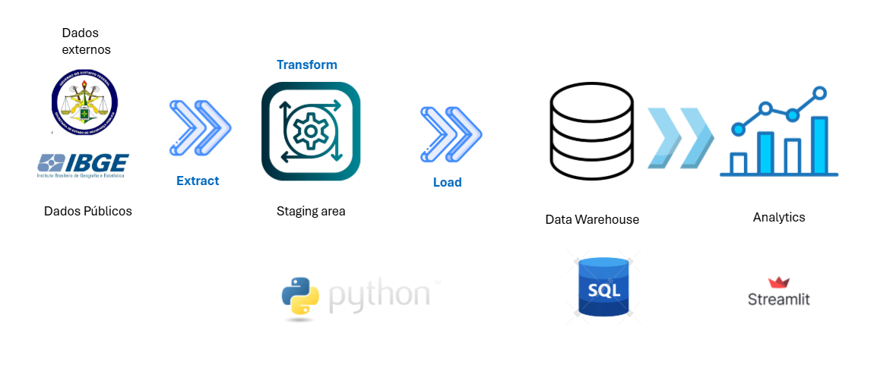

# Protejo Criminalidade Brasília - DF

### Pepiline de Dados


### Arquitetura


## 🧠 Diagrama de Arquitetura Lógica — Projeto de Análise e Predição de Criminalidade no DF

Abaixo está o **Diagrama de Arquitetura Lógica** do projeto de *Análise e Predição de Criminalidade no Distrito Federal*, cobrindo todo o fluxo — desde a ingestão dos dados da SSP-DF até a visualização interativa em Streamlit, integrando processamento geoespacial, modelagem preditiva e banco de dados PostgreSQL/PostGIS.


```bash
                             ┌───────────────────────────────┐
                             │   Fontes de Dados Externas    │
                             │───────────────────────────────│
                             │ - SSP-DF (Ocorrências)        │
                             │ - IBGE (Socioeconômicos)      │
                             │ - GeoDF / IBGE (Mapas)        │
                             │ - Delegacias, Iluminação etc. │
                             └──────────────┬────────────────┘
                                            │
                                            ▼
                           ┌───────────────────────────────────────┐
                           │         Camada de Ingestão            │
                           │───────────────────────────────────────│
                           │ • Scripts Python (requests, pandas)   │
                           │ • Extração + Padronização             │
                           │ • Geocodificação (Nominatim / API)    │
                           │ • Validação e salvamento RAW          │
                           └──────────────┬────────────────────────┘
                                          │
                                          ▼
                    ┌───────────────────────────────────────────────┐
                    │             Banco de Dados (PostgreSQL)       │
                    │───────────────────────────────────────────────│
                    │  Extensão: PostGIS                            │
                    │  Tabelas:                                     │
                    │   - incidents (ocorrências geolocalizadas)    │
                    │   - grid_cells (malha hexagonal 500m)         │
                    │   - features (dados agregados)                │
                    │   - predictions (resultados de modelos)       │
                    │  Índices: GIST (geom), temporais              │
                    └──────────────┬────────────────────────────────┘
                                   │
                                   ▼
             ┌────────────────────────────────────────────────────────┐
             │              Camada de Processamento / ETL             │
             │────────────────────────────────────────────────────────│
             │  Scripts Python (Pandas, GeoPandas, SQLAlchemy)        │
             │  - Limpeza e normalização                              │
             │  - Agregação espacial (por cell_id)                    │
             │  - Enriquecimento (dados IBGE, distâncias, clima)      │
             │  - Feature Engineering (temporal, espacial, rolling)   │
             │  - Armazenamento no Postgres (tabela features)         │
             └──────────────┬─────────────────────────────────────────┘
                            │
                            ▼
       ┌────────────────────────────────────────────────────────────────────┐
       │                       Camada de Modelagem ML                       │
       │────────────────────────────────────────────────────────────────────│
       │  Frameworks: scikit-learn, XGBoost, CatBoost, PyTorch              │
       │  - Seleção de variáveis e rótulos (risk = alto/baixo)              │
       │  - Treinamento e validação temporal/espacial                       │
       │  - Avaliação (Precision@K, ROC-AUC, F1, etc.)                      │
       │  - Exportação de modelos (Pickle / ONNX)                           │
       │  - Registro de métricas (MLflow opcional)                          │
       └──────────────┬─────────────────────────────────────────────────────┘
                      │
                      ▼
    ┌────────────────────────────────────────────────────────────────────────┐
    │                   Camada de Visualização e Aplicação                   │
    │────────────────────────────────────────────────────────────────────────│
    │  - Dashboard (Streamlit + Plotly + GeoPandas)                          │
    │  - Mapas de calor e hotspots                                           │
    │  - Séries temporais e comparativos                                     │
    │  - Aba de previsões (risco por célula / bairro)                        │
    │  - Exportação de relatórios e CSVs                                     │
    │  - (Opcional) API FastAPI → servir predições                           │
    └────────────────────────────────────────────────────────────────────────┘


[SSP-DF / IBGE / GeoDF]
          ↓
   [Ingestão e ETL]
          ↓
   [PostgreSQL + PostGIS]
          ↓
   [Processamento e Feature Engineering]
          ↓
   [Modelos ML / Predições]
          ↓
   [Dashboard Streamlit + Plotly]

```

## ⚙️ Componentes Técnicos e Tecnologias

| **Camada** | **Ferramentas / Bibliotecas** | **Responsabilidade** |
|:------------|:------------------------------|:----------------------|
| **Coleta** | `requests`, `pandas`, `geopy` | Baixar, padronizar e geocodificar dados da SSP-DF |
| **Banco de Dados** | `PostgreSQL + PostGIS` | Armazenar dados espaciais e tabelas de features |
| **Processamento / ETL** | `pandas`, `geopandas`, `sqlalchemy`, `shapely` | Limpeza, junção e agregação espacial |
| **Modelagem** | `scikit-learn`, `XGBoost`, `CatBoost`, `PyTorch` | Treinar modelos preditivos de risco |
| **Visualização** | `Plotly`, `Streamlit`, `Folium` | Mapas interativos, dashboards e relatórios |
| **Orquestração (opcional)** | `Airflow`, `Prefect` | Automação do pipeline |
| **Controle de Versão** | `Git`, `DVC` *(opcional)* | Versionar dados e modelos |
| **Deploy** | `Docker`, `GitHub Actions` | Criar ambiente reprodutível e CI/CD |

### 🧩 Interações Principais

- **ETL → Postgres:** Responsável por transformar e carregar os dados brutos em formato limpo e estruturado dentro do banco PostgreSQL/PostGIS.  
- **ML → lê features do Postgres → gera `predictions`:** A camada de modelagem acessa as *features* pré-processadas, treina modelos de risco e grava as previsões no banco.  
- **Dashboard → lê `predictions` e `features` → gera visualizações:** O Streamlit consome as saídas do modelo e apresenta mapas, séries temporais e análises interativas.  
- **(Opcional) API → expõe predições:** Uma API (FastAPI) pode disponibilizar as previsões e métricas para integração com ferramentas externas, como Power BI, QGIS ou sistemas operacionais de segurança pública.
